# Graph Search Algorithms in Seattle

**Author:** Jennie Lin
## Overview
This project implements Breadth-First Search (BFS), Depth-First Search (DFS), and A* search algorithms on a simplified map of Seattle neighborhoods. The graph represents various Seattle neighborhoods as nodes, connected by weighted edges that represent distances between them.
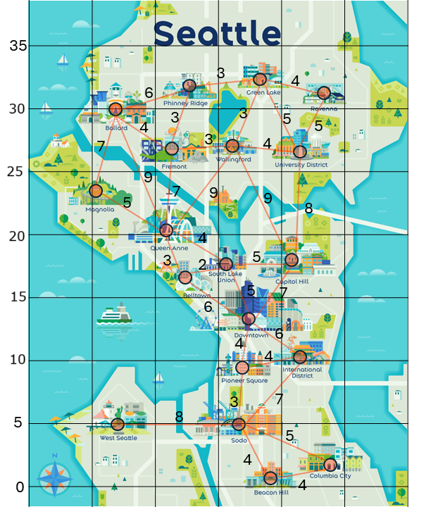

## Installation
Ensure you have Python 3 and the required packages installed. Install dependencies with:

```bash
pip install networkx matplotlib
```
## Usage
Run the script from the command line:

```bash
python script_name.py
```
The program will plot the pathfinding results for each search method (BFS, DFS, and A*) for several source-target pairs on the map. It will display the traversal and final path with corresponding costs.

## Graph Structure
This graph simulates distances between Seattle neighborhoods. Each node represents a neighborhood, and each edge's weight represents a distance. Nodes are manually positioned on a 2D grid for visual clarity, and edges are defined with specific weights.

### Nodes
Neighborhoods like Ballard, Capitol Hill, Downtown, and West Seattle are represented as nodes.

### Edges
Each edge has a weight representing the "distance" between two neighborhoods. Examples:

- ```('West Seattle', 'Sodo', 8)```
- ```('Pioneer Square', 'Downtown', 4)```
## Algorithms
### Breadth-First Search (BFS)
Finds the shortest path by level-order traversal. Returns a list of traversed edges.

### Depth-First Search (DFS)
Performs a depth-limited search to find a path to the target. Returns a list of traversed edges.

### A* Search
Uses a heuristic (Euclidean distance) for an informed search that minimizes total cost to reach the target. Returns the final path and total cost.

## Visualization
Each search result is visualized as follows:

1. Nodes and edges along the found path are highlighted.
2. Each path's cost is displayed in the plot title.
3. Each plot has labeled nodes and edges, showing search progression and final path.
## Sample Visualization
Each search method is visualized, showing the path and its cost:

### Connect Ballard to Columbia City

method   |   without            |  with weight
:-------------------------:|:-------------------------:|:-------------------------:
BFS   |   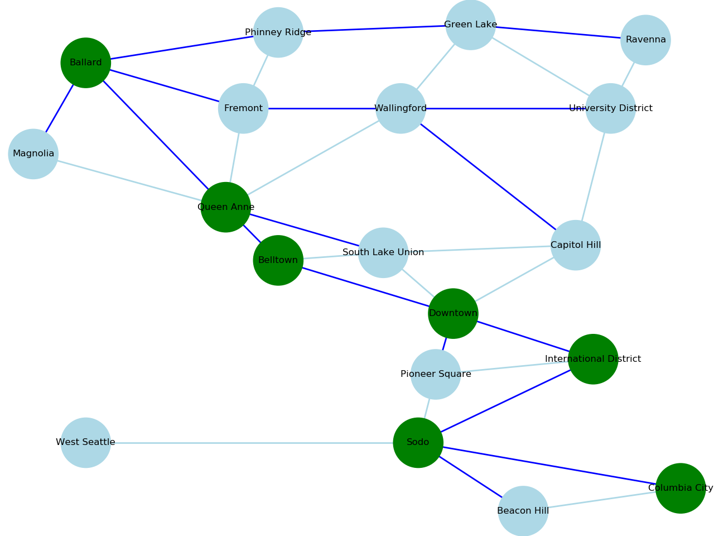   |   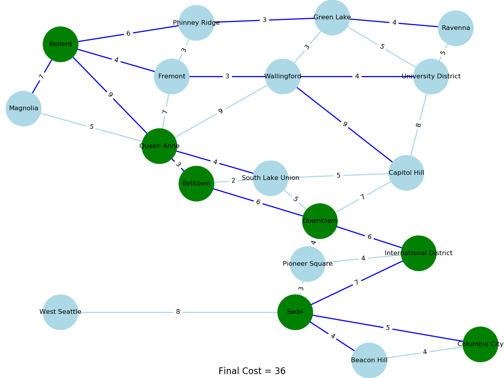
DFS   |   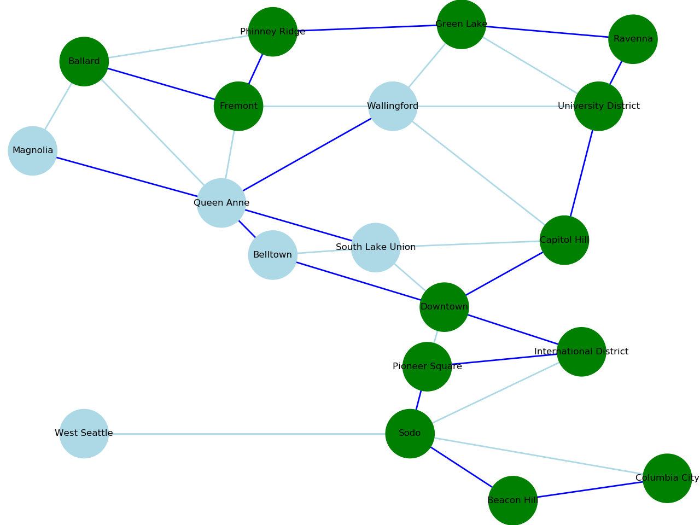   |   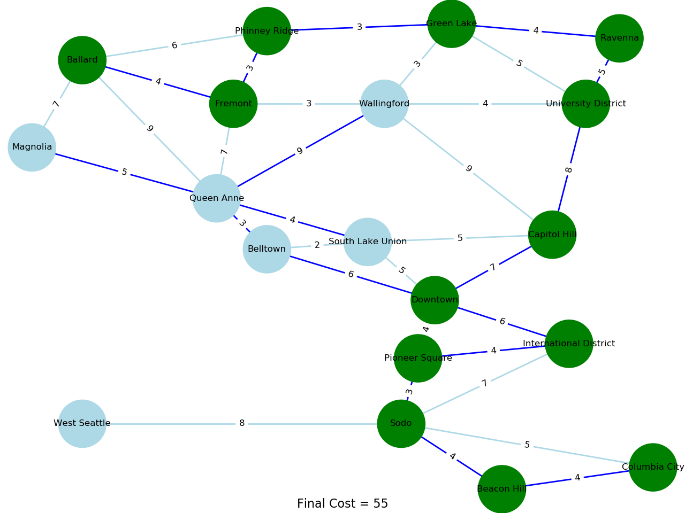
A*   |   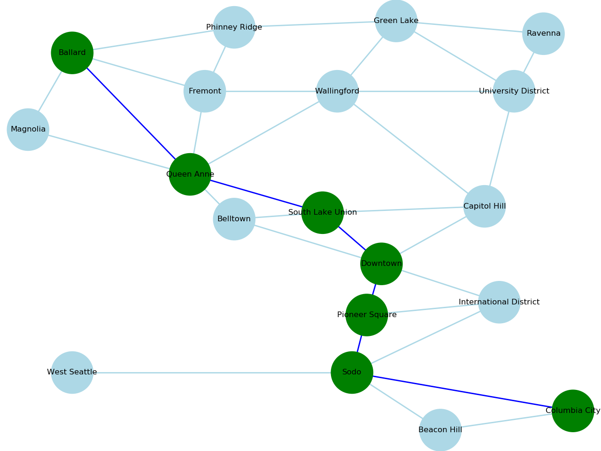   |   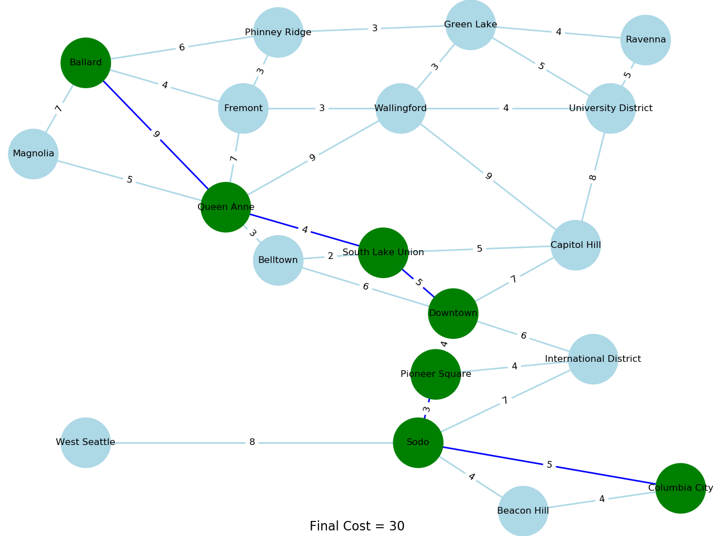

### Connect West Seattle to Magnolia

method   |   without            |  with weight
:-------------------------:|:-------------------------:|:-------------------------:
BFS   |   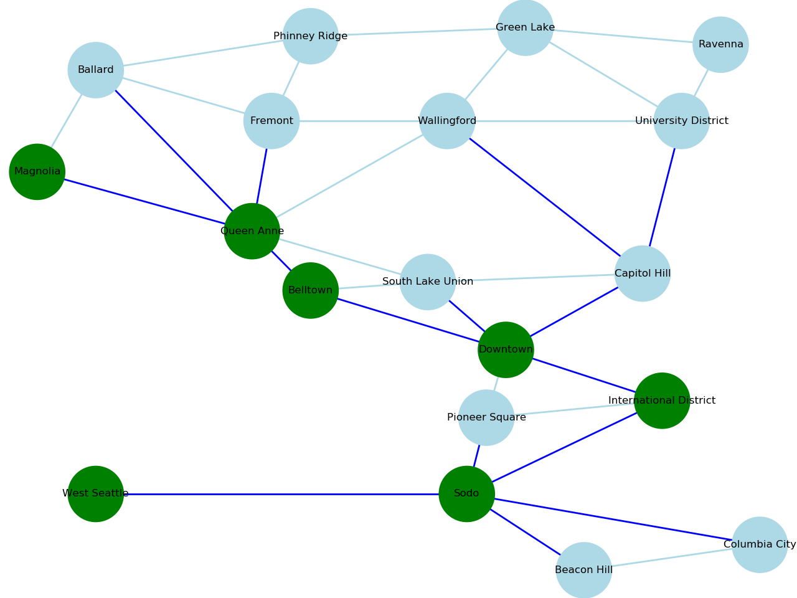   |   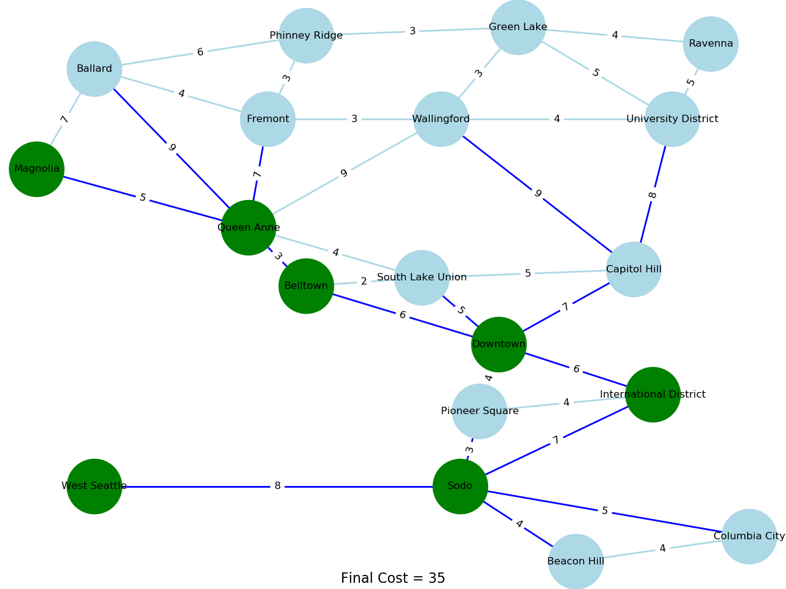
DFS   |   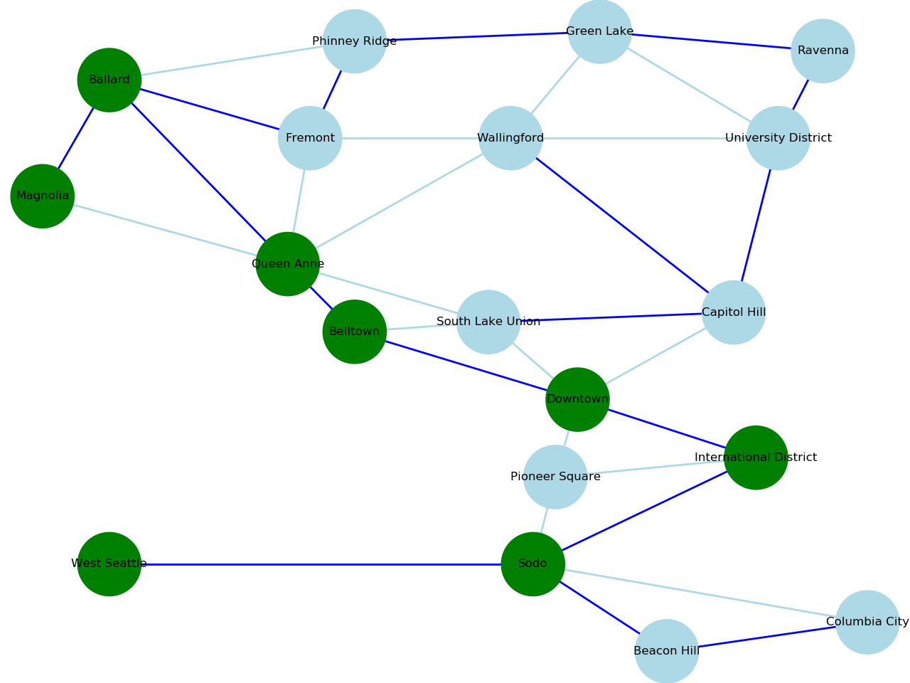   |   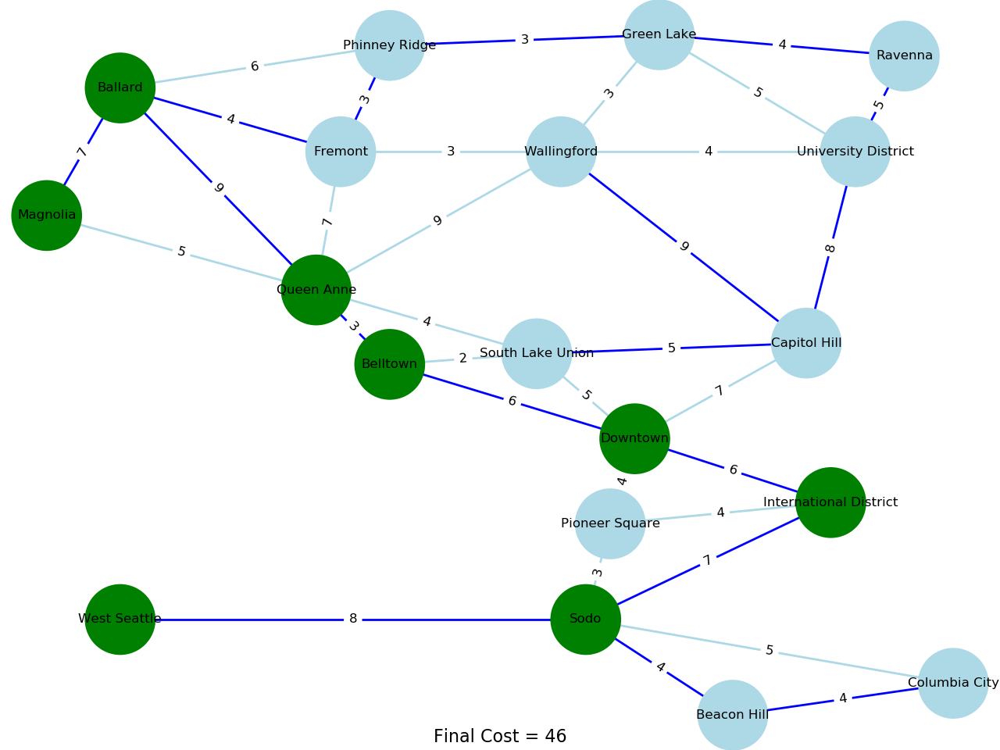
A*   |   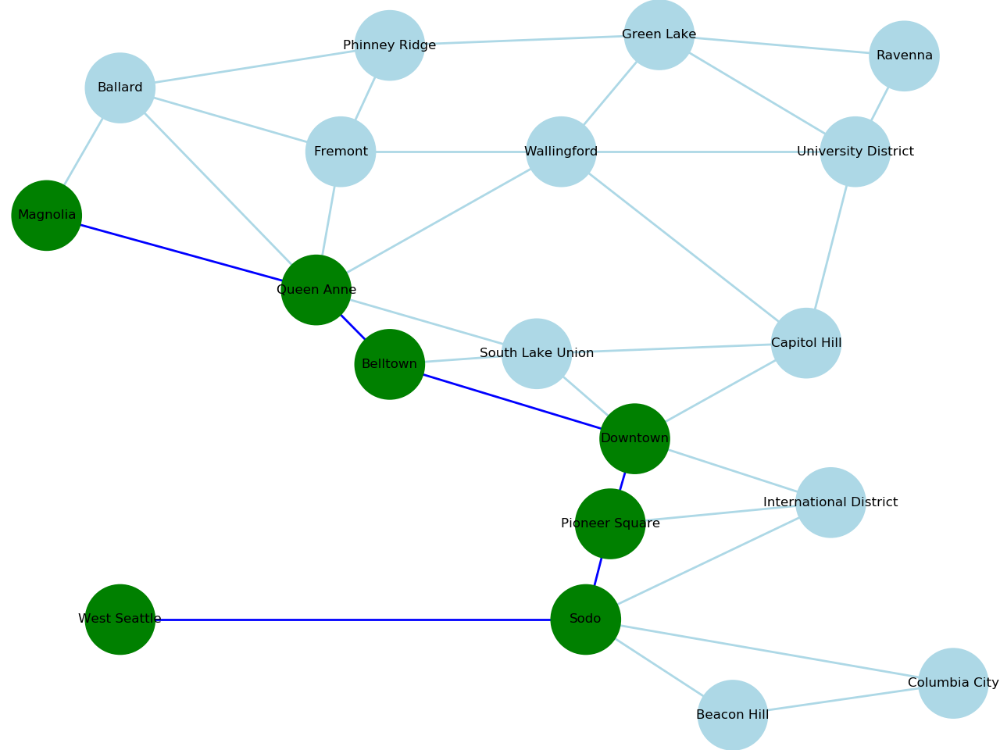   |   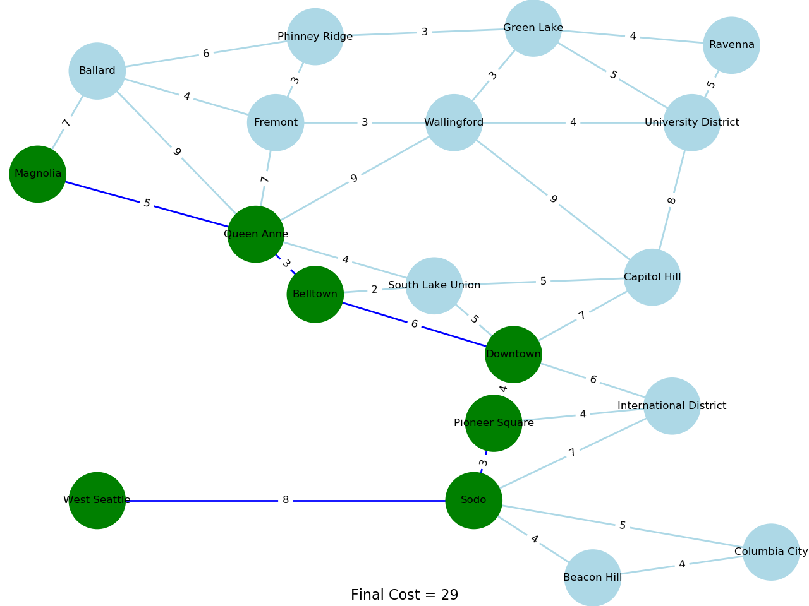
